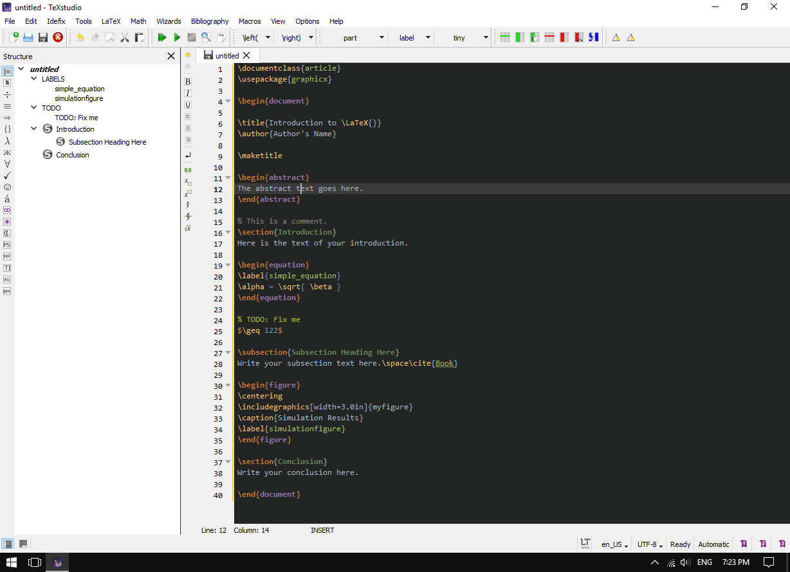

# Darcula for [TeXstudio](https://www.texstudio.org/)

> A dark theme for [TeXstudio](https://www.texstudio.org/), based on [JetBrains](https://www.jetbrains.com/) dark theme.

# Install

1. Open TeXstudio, go to __Options__ > __Save Profile...__ and save a backup of the current profile to something like `default.txsprofile` on your Desktop.
2. Create a copy of the file `default.txsprofile` and rename it to `darcula.txsprofile`.
3. Download [this dark theme](./texstudio-darcula-dark-theme.txsprofile), open it in your editor, select all and copy it.
4. Open `darcula.txsprofile` in your text editor, scroll to the bottom.
5. Paste the copied dark theme below `[formats] version=1.0` and save.
6. Back to TeXstudio again, go to __Options__ > __Load Profile...__ and load the newly edited `darcula.txsprofile`.
7. Restart Texstudio to apply the dark theme.
8. Finally, you can further modify the color scheme by going to __Options__ > __Configure TeXstudio...__ > __Syntax Highlighting__.

# License

[The Unlicense](./LICENSE)